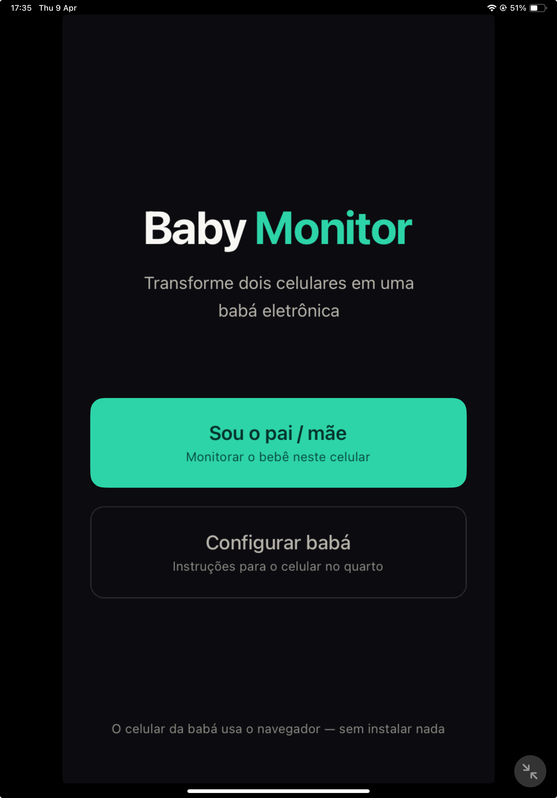

# Baby Monitor

Smart baby monitor — turn two smartphones into a full monitoring system with audio, video, talk-back and remote soothing.

**Parent station**: React Native app (installed on the parent's phone)
**Baby station**: Web app (opens in the browser of any old phone, zero install)

Audio and video stream peer-to-peer via WebRTC. The server only handles the initial handshake.

<p align="center">
  
</p>

## Features

**Streaming**
- One-way audio (baby → parent), always on
- Optional video with parent-controlled toggle and bitrate presets (low / normal / high)
- Push-to-talk talk-back (parent → baby), mutes baby mic during transmission
- Remote flashlight toggle (uses the baby phone's camera torch)

**Monitoring**
- Real-time dB meter with threshold-based color coding (silence / quiet / moderate / loud)
- Configurable noise threshold, debounced over 3 consecutive readings to avoid false positives
- Visual + haptic + audible alert when threshold is breached, auto-dismisses after 5s of quiet
- Session timer
- Baby device battery indicator with low-charge warning

**Reliability**
- Background mode on the parent (foreground service + audio session keeps monitoring alive when minimized)
- Screen wake lock on the baby (prevents the browser tab from being throttled by the OS)
- Auto-reconnect on transient network drops via Socket.IO + WebRTC ICE restart

**Soothing**
- Remote lullaby playback synthesized live in the baby browser (white noise and heartbeat patterns), no audio assets bundled

## How it works

```
  Parent's phone                          Old phone in baby's room
  (React Native app)                      (Web browser)
  ┌────────────────────┐                  ┌────────────────────┐
  │                    │   WebRTC P2P     │                    │
  │  "Sou o pai/mãe"   │◄──── audio ─────│  Mic + camera      │
  │  Get room code     │   ◄─ video ────  │  Wake lock held    │
  │  See dB + video    │   ── voice ───►  │  Lullaby speaker   │
  │  Toggle commands   │   ◄ telemetry │  │  Battery report    │
  └─────────┬──────────┘                  └─────────┬──────────┘
            │                                       │
            │              Socket.IO                │
            └──────────────┬────────────────────────┘
                           │
                  ┌────────▼────────┐
                  │ Signaling Server │
                  │ (handshake only) │
                  └─────────────────┘
```

**Step by step:**
1. Open the mobile app on the parent's phone → tap **"Sou o pai/mãe"** → a 6-character room code appears
2. On a second phone (baby station), open the web URL in the browser **or** scan the link with the code embedded → grant mic/camera permission
3. The baby station starts streaming audio (and video, if enabled) directly to the parent (P2P)
4. If the dB level stays above the threshold for 3+ consecutive readings, the parent phone vibrates, flashes red, and plays a notification sound until the noise drops or the parent dismisses it

## Quick start

### Prerequisites

- Node.js >= 20
- pnpm >= 9 (`npm install -g pnpm`)
- A development build of the mobile app (Expo Go is not supported because of `react-native-webrtc`)
- A second device with a modern browser for the baby station
- Both devices on the **same Wi-Fi network** (or a TURN server configured for cross-network use)

### Run

```bash
git clone <repo-url>
cd baby-monitor-mvp
./start
```

The `start` script will:
1. Detect your local IP address automatically
2. Kill any existing processes on ports 3003, 5175, 8081
3. Install dependencies if needed
4. Create `.env` from `.env.example` if missing
5. Start all services (server + web + mobile)
6. Print URLs with your local IP

After `./start`, the terminal shows your local IP and URLs:

```
   Server:  http://192.168.x.x:3003
   Web:     http://192.168.x.x:5175
   Mobile:  Metro on port 8081
```

1. **Parent (mobile app)**: launches via Expo development build
2. **Baby (web)**: open `http://<your-ip>:5175` in another device's browser
3. Parent taps "Sou o pai/mãe" → gets a code
4. Baby enters the code → connection established

### Run services individually

```bash
pnpm dev:server   # http://localhost:3003
pnpm dev:web      # http://localhost:5175
pnpm dev:mobile   # Expo Dev Client on port 8081
```

## Mobile app setup (first time)

The mobile app requires a development build (not Expo Go) because of native modules.

```bash
npm install -g eas-cli
eas login

cd apps/mobile
npx expo run:ios --device     # or run:android

# After first build, just use ./start from the root.
```

## Architecture

| Layer | Technology |
|---|---|
| Mobile | React Native, Expo Dev Client, react-native-webrtc, Zustand |
| Web | TypeScript, Vite, native WebRTC + Web Audio APIs |
| Server | Node.js, Express, Socket.IO |
| Shared | TypeScript, Turborepo monorepo, design tokens |

### Clean Architecture

All three apps follow strict layer separation:

```
src/
├── domain/          # Pure business logic, zero external deps
├── data/            # (server) repositories
├── application/     # use cases (where applicable)
├── infrastructure/  # WebRTC, signaling, audio, battery, wake lock adapters
└── presentation/    # screens, components, stores, UI
```

Dependencies always point inward. Domain entities are framework-free and unit-testable in isolation.

### Project layout

```
baby-monitor-mvp/
├── apps/
│   ├── mobile/          # React Native (parent station)
│   ├── web/             # Vite + TypeScript (baby station)
│   └── server/          # Node.js signaling server
├── packages/
│   ├── shared-types/    # TypeScript interfaces, DataChannel + signaling DTOs
│   ├── webrtc-config/   # ICE servers, audio/video constraints, bitrate presets
│   └── design-tokens/   # Colors, spacing, dB thresholds
├── start                # One-command startup script
├── .env.example
└── turbo.json
```

## Testing

The project ships with **200 unit tests** across 17 suites covering ~95% of statements in the testable layers.

```bash
pnpm test           # run all tests across the monorepo
pnpm test:unit      # alias — same as above
pnpm typecheck      # strict TypeScript across all packages
```

| Package | Stack | Tests | Coverage (statements) |
|---|---|---|---|
| `apps/server` | Jest | 38 | 97.3% |
| `apps/web` | Vitest + happy-dom | 140 | 97.7% |
| `apps/mobile` | Jest | 22 | 86% (domain + stores) |

Per-package coverage:

```bash
pnpm --filter @baby-monitor/web test:coverage
cd apps/server && pnpm jest --coverage
cd apps/mobile && pnpm jest --coverage
```

The web suite uses small in-test fakes for `AudioContext`, `RTCPeerConnection`, `navigator.wakeLock`, and `navigator.getBattery` (see `apps/web/tests/helpers/`) — no heavy mocking libraries.

## Environment variables

| Variable | Default | Used by | Description |
|---|---|---|---|
| `PORT` | `3003` | Server | Signaling server port |
| `CORS_ORIGIN` | `*` | Server | Allowed origins |
| `SIGNALING_URL` | auto-detected | Web, Mobile | Signaling server URL (set by `./start`) |
| `BABY_STATION_URL` | auto-detected | Mobile | Web app URL for the pairing screen |
| `TURN_URL` | _(empty)_ | Web, Mobile | TURN server (optional, for cross-network use) |
| `TURN_USER` | _(empty)_ | Web, Mobile | TURN username |
| `TURN_PASS` | _(empty)_ | Web, Mobile | TURN password |

> `SIGNALING_URL` and `BABY_STATION_URL` are auto-detected by `./start` from your local IP. Set them manually only if running services without the script.

## Ports

| Service | Port |
|---|---|
| Server (Express + Socket.IO) | 3003 |
| Web (Vite) | 5175 |
| Mobile (Metro) | 8081 |

## Commands

```bash
./start             # Start everything (recommended)
pnpm dev            # Start all services via Turborepo
pnpm build          # Build all apps
pnpm test           # Run all unit tests
pnpm typecheck      # Type check all packages
```

## Troubleshooting

**Mobile app shows blank screen / can't connect**
- Both devices must be on the same Wi-Fi network (or you need TURN configured)
- Check that `./start` detected the right IP
- The mobile app requires a development build, not Expo Go

**Web app shows "process is not defined"**
- The Vite config defines `process.env` replacements — make sure you're running via `./start` or `pnpm dev:web`

**`EADDRINUSE` error**
- A previous process is still using the port. `./start` auto-kills old processes; manually: `kill -9 $(lsof -ti:3003)`

**TURN server needed?**
- Same Wi-Fi: no, STUN is enough
- Different networks (e.g., 4G + Wi-Fi): yes, configure TURN in `.env`

## License

MIT
